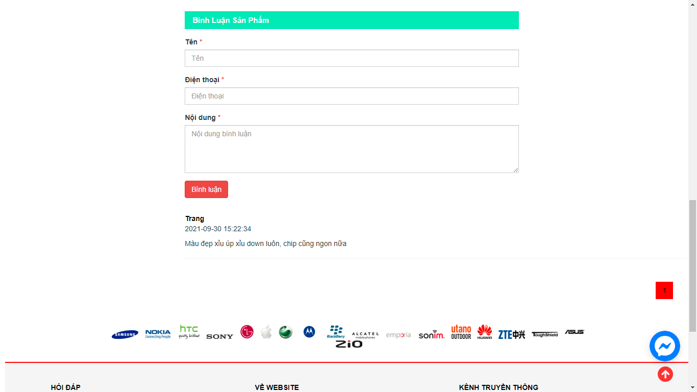

# Đồ Án Web PHP

## Đề tài: Website bán điện thoại

### tải xuống

```bash
	git clone https://github.com/xuanchinh97/Do-An-Web-PHP.git
```

### Yêu cầu phần mềm:
- Visual Studio, Xamp

### sử dụng

- Vào phpmyadmin tạo csdl mới, đặt tên là: mobileshop
- import file mobileshop.sql vào trong csdl vừa tạo

- Config file  ketnoi.php trong thư mục cauhinh\ketnoi.php

```bash
	$dbhost='localhost'; // để mặc định
	$dbuser='root';	     // tên user trong mysql, mặc định thường là root
	$dbpass='';	     // mật khẩu của user bên trên nếu có thì thêm vào 
	$dbname='shopdienthoai'; // tên database vửa tạo bên trên
```

- Config file  ketnoi.php trong thư mục quantri\ketnoi.php

cấu hình tương tự bên trên	

### truy cập trang quản trị

- gmail: admin@gmail.com
- pass: admin

** Lưu ý : mọi người chú ý cổng mà mình đang chạy trên localhost nhé
- mặc định là cổng 8080 thì sẽ như vầy: http://localhost/
- của mình để cổng 97 thì sẽ như vầy: http://localhost:97/
- thay đổi gmail hoặc pass quản trị thì phải đổi lại trong phần quantri/chucnang/tên chức năng/xóa.chức năng

### Screenshot





